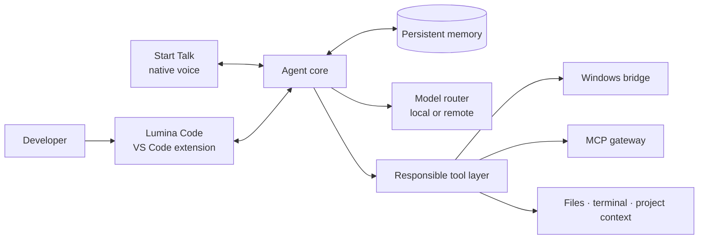

<p align="center">
  
</p>

<h1 align="center">Lumina Code</h1>

<p align="center">
  <strong>IA que trabaja a tu lado.</strong><br>
  <em>A Windows-first, local-first AI coding agent built around voice, memory, and responsible tools.</em>
</p>

<p align="center">
  
  
  
  
</p>

<p align="center">
  <a href="#estado-del-proyecto--project-status">Estado</a> ·
  <a href="#arquitectura-en-evolución--evolving-architecture">Arquitectura</a> ·
  <a href="#instalación-y-requisitos--installation-and-requirements">Instalación</a> ·
  <a href="#configuración-recomendada-de-modelos--recommended-model-setup">Modelos</a> ·
  <a href="CONTRIBUTING.md">Contribuir</a> ·
  <a href="ROADMAP.md">Roadmap</a> ·
  <a href="SECURITY.md">Seguridad</a>
</p>

> [!IMPORTANT] > **Lumina Code ya ofrece una extensión estable y funcional para VS Code en Windows.** La rama `main` incluye un flujo reproducible para abrirla en modo desarrollo o generar e instalar un VSIX. El proyecto continúa evolucionando y todavía no se distribuye mediante Visual Studio Marketplace; los issues, las propuestas, la documentación y los pull requests enfocados son bienvenidos.

## Qué es / What it is

**Lumina Code** es un agente de programación para Windows que busca reunir en una sola experiencia capacidades que normalmente viven separadas: conversación sobre código, ejecución asistida por herramientas, voz nativa, memoria persistente e interoperabilidad mediante MCP.

El objetivo no es crear otro cuadro de chat. Es construir un colaborador técnico que pueda comprender el contexto de un proyecto, explicar sus decisiones, pedir confirmación cuando una acción lo requiere y permanecer útil durante sesiones reales de trabajo.

**English:** Lumina Code is a Windows-first AI coding agent that brings code conversation, tool-assisted work, native voice, persistent memory, and MCP interoperability into one coherent experience. It is being developed as a technical collaborator, not merely another chat panel.

## Principios del proyecto / Project principles

| Principio                    | Qué significa                                                                                                                       |
| ---------------------------- | ----------------------------------------------------------------------------------------------------------------------------------- |
| **Local-first**              | El runtime, los puentes y el control permanecen cerca del usuario. Los modelos pueden ser locales o remotos según la configuración. |
| **Windows-first**            | La experiencia se diseña y prueba primero sobre flujos reales de Windows y VS Code.                                                 |
| **Voz como interfaz real**   | Start Talk busca convertir la conversación por voz en una parte nativa del trabajo, no en un complemento decorativo.                |
| **Herramientas con límites** | Las acciones sensibles deben ser explícitas, verificables, auditables y restringidas por contexto.                                  |
| **Memoria con propósito**    | Recordar debe mejorar la continuidad sin ocultar al usuario qué información se conserva ni por qué.                                 |
| **Interoperabilidad**        | MCP y los puentes modulares permiten conectar Lumina Code con otros clientes y herramientas.                                        |

## Capacidades principales / Main capabilities

- Agente de código dentro de VS Code.
- Experiencia de voz nativa **Start Talk** con orbe de escritorio.
- Contexto y memoria entre sesiones.
- Enrutamiento entre proveedores de modelos y opciones locales.
- Herramientas responsables para archivos, terminal y flujos de desarrollo.
- Puente Windows para acciones de escritorio con controles de seguridad.
- Gateway MCP para interoperar con otros clientes compatibles.
- Registro de actividad y superficies de transparencia para acciones del agente.

### Flujos avanzados del agente

La interfaz incluye acciones integradas que se abren escribiendo `/` en el chat. La selección elimina el texto del comando, devuelve el foco al editor y nunca envía el nombre del comando al modelo.

| Comando     | Función                                                                                                                                                            |
| ----------- | ------------------------------------------------------------------------------------------------------------------------------------------------------------------ |
| `/goal`     | Define una meta con un diálogo nativo. El agente continúa por turnos, usa un juez separado y se detiene al completar, bloquearse, cancelarse o alcanzar el límite. |
| `/github`   | Prepara una sesión nueva desde la URL de un issue o pull request, incluyendo comentarios y contexto del diff de un PR. No ejecuta el agente automáticamente.       |
| `/changes`  | Convierte el diff del workspace en un recorrido guiado por archivo y bloque, con navegación al código y aceptación o rechazo de cambios pendientes.                |
| `/work`     | Reúne workboard persistente, plan del agente, sesión activa, metas, aprobaciones, actividad, historial, tokens y costes conocidos.                                  |
| `/schedule` | Crea trabajos persistentes únicos, diarios, semanales o cron; permite pausar, editar, ejecutar ahora y revisar resultados.                                         |

Los trabajos programados se guardan localmente y solo se ejecutan mientras el host de Lumina Code está disponible. Crear una programación es una autorización explícita para ejecutar ese prompt en las fechas configuradas; los límites de herramientas y aprobaciones siguen aplicándose. Consulta [Flujos avanzados del agente](docs/AGENT_WORKFLOWS.md) para conocer el comportamiento, las credenciales y los límites de seguridad.

Estas capacidades forman parte de la experiencia funcional actual. Algunas integraciones requieren credenciales propias o componentes opcionales, tal como se explica en la sección de instalación.

#### Sesiones, forks y worktrees

El centro **Sesiones** permite retomar, buscar, renombrar, exportar, eliminar o
bifurcar conversaciones. Cada respuesta terminada incluye la acción **Fork**
para abrir una sesión nueva conservando el contexto exactamente hasta ese
punto; el linaje queda persistido y el uso/coste de la rama nueva empieza desde
cero. Crear un fork nunca ejecuta el modelo por sí solo.

La pestaña **Worktrees** administra worktrees Git reales del repositorio activo:
crea una rama aislada desde `HEAD` u otra referencia, muestra si cada árbol está
limpio o tiene cambios y puede abrirlo en otra ventana de VS Code. Lumina Code
no permite eliminar el worktree principal ni uno bloqueado, y Git rechaza por
defecto la eliminación de un árbol con cambios. Los nuevos directorios se crean
junto al repositorio, bajo `<repositorio>-worktrees`, para no contaminar el
workspace principal. Si se bifurca el chat al crear o abrir un worktree, la
nueva ventana reclama esa sesión una sola vez y la carga automáticamente.

### Una sola interfaz evolucionada

Lumina Code usa **una única GUI React dentro de la extensión**. El lenguaje
visual y los patrones de navegación desarrollados en Lumina-Openclaw se han
adaptado directamente al webview existente, sin `iframe`, segunda aplicación ni
un segundo core. El editor TipTap, el historial de Continue, los diffs, las
herramientas y los protocolos de la extensión siguen siendo la base funcional.

La experiencia unificada incorpora:

- navegación responsive con modo compacto, sesiones recientes y paleta
  `Ctrl+K`;
- chat de ancho legible, compositor ampliado, estado del modelo y mensajes en
  cola mientras el agente termina el turno actual;
- paneles reales de Trabajo, Cambios, Automatizaciones, Conocimiento y
  Conexiones;
- centro de configuración responsive para modelos, reglas, herramientas MCP,
  habilidades, permisos, runtime y Start Talk;
- rutas compatibles con conceptos del workspace Lumina-Openclaw como
  `/sessions`, `/worktrees`, `/usage`, `/automations`, `/settings/talk`, `/logs`
  y `/debug`,
  redirigidas a superficies nativas de la misma GUI.

La arquitectura y el mapa de absorción están documentados en
[Workspace unificado](docs/UNIFIED_WORKSPACE.md).

## Estado del proyecto / Project status

| Área                                      | Estado público                                          |
| ----------------------------------------- | ------------------------------------------------------- |
| Extensión de VS Code para Windows x64     | **Estable y funcional desde el código fuente**          |
| Development Host                          | **Verificado con launcher automatizado**                |
| Generación e instalación manual del VSIX  | **Disponible y documentada**                            |
| Start Talk y puente nativo de voz         | **Funcional; requiere Gemini API**                      |
| Chat, edición y agente de código          | **Funcional; requiere configurar un modelo**            |
| Metas, GitHub, cambios, panel y scheduler | **Funcionales y cubiertos por pruebas automatizadas**   |
| Sesiones, forks y worktrees Git           | **Funcionales y cubiertos por pruebas automatizadas**   |
| Workboard, tareas, actividad y dashboard  | **Persistentes y cubiertos por pruebas automatizadas**  |
| Licencia y atribuciones                   | Publicadas en [`LICENSE`](LICENSE) y [`NOTICE`](NOTICE) |
| Publicación en Visual Studio Marketplace  | Aún no disponible                                       |

El repositorio ya no depende de copias manuales de los módulos nativos usados por la extensión: los scripts preparan y validan SQLite, LanceDB y las dependencias empaquetadas necesarias. La distribución actual es una build comunitaria desde el código fuente; no es un VSIX firmado ni una publicación de Marketplace.

## Arquitectura en evolución / Evolving architecture



La arquitectura se mantiene modular para separar razonamiento, memoria, voz y acciones del sistema. Los límites entre estos componentes forman parte del trabajo activo de estabilización.

## Instalación y requisitos / Installation and requirements

> [!WARNING] > **Este es el flujo oficial para usuarios y colaboradores en Windows x64.** Produce una extensión funcional, aunque el VSIX se genera localmente y no está firmado ni publicado todavía en Visual Studio Marketplace. Como con cualquier extensión instalada desde código fuente, revisa el commit que vas a compilar.

Los requisitos del entorno de desarrollo y empaquetado son:

| Requisito                            | Uso previsto                                                              |
| ------------------------------------ | ------------------------------------------------------------------------- |
| Windows 10/11 x64                    | Plataforma de build documentada actualmente                               |
| VS Code 1.70 o superior              | Extension Development Host                                                |
| Git                                  | Clonación y flujo de contribución                                         |
| Node.js 20.20.1                      | Extensión y monorepo base; versión indicada en `continue-upstream/.nvmrc` |
| Rust `stable-msvc`                   | Aplicación nativa Start Talk basada en Tauri                              |
| Microsoft C++ Build Tools y WebView2 | Requisitos de Tauri sobre Windows                                         |
| Node.js 22                           | Bridges TypeScript opcionales; no se usa para empaquetar la extensión     |
| Python                               | Sidecars opcionales para ciertas integraciones Windows                    |

### Preparar el proyecto y abrirlo en modo desarrollador

```powershell
git clone https://github.com/I24D/Lumina_Code.git
cd Lumina_Code\Start-talk
npm install
npm run tauri build -- --no-bundle
cd ..\continue-upstream
powershell -NoProfile -ExecutionPolicy Bypass -File .\scripts\install-dependencies.ps1
cd ..
powershell -NoProfile -ExecutionPolicy Bypass -File .\ABRIR_LUMINA_CODE_DEV.ps1
```

Start Talk debe compilarse primero porque su ejecutable se incluye dentro del VSIX. `install-dependencies.ps1` no es una comprobación pasiva: instala dependencias, compila los módulos compartidos, prepara los recursos nativos y genera un primer paquete. El proceso necesita red y puede tardar según el equipo.

El launcher abre un **VS Code Extension Development Host aislado** y levanta la interfaz de desarrollo en `127.0.0.1:5174`; no reemplaza tu instalación normal de VS Code.

### Configuración recomendada de modelos / Recommended model setup

Lumina Code permite configurar otros proveedores, pero la configuración de referencia del autor —y la combinación recomendada para reproducir el funcionamiento actual— es la siguiente:

| Función                                    | Proveedor    | Modelo                                 | Credencial necesaria                 |
| ------------------------------------------ | ------------ | -------------------------------------- | ------------------------------------ |
| Chat principal, edición y agente de código | Ollama Cloud | `kimi-k3:cloud`                        | API key de Ollama                    |
| Modelo alternativo de chat y agente        | Ollama Cloud | `glm-5.2:cloud`                        | La misma API key de Ollama           |
| Voz en tiempo real mediante Start Talk     | Gemini Live  | `gemini-2.5-flash-native-audio-latest` | `GEMINI_API_KEY` de Google AI Studio |

#### Chat y agente: Kimi K3 con GLM-5.2 disponible

1. Crea una API key en [Ollama](https://ollama.com/settings/keys).
2. En Lumina Code, abre **Add model** y selecciona **Ollama Cloud**. El flujo recomendado agrega **Kimi K3 (Ollama Cloud)** primero y conserva **GLM-5.2 (Ollama Cloud)** como alternativa.
3. Introduce la API key cuando la interfaz la solicite. Ambos modelos usan:
   - proveedor: `ollama`;
   - modelos: `kimi-k3:cloud` y `glm-5.2:cloud`;
   - API base: `https://ollama.com/`.
4. Selecciona **Kimi K3** para los roles de chat, edición y aplicación. Puedes cambiar a **GLM-5.2** desde el selector sin volver a configurar la credencial.

Las fichas oficiales y su disponibilidad se encuentran en [Ollama Library: Kimi K3](https://ollama.com/library/kimi-k3) y [Ollama Library: GLM 5.2](https://ollama.com/library/glm-5.2). Ollama Cloud evita necesitar una GPU local capaz de ejecutar estos modelos, pero requiere una cuenta y está sujeto a los límites y precios de Ollama.

#### Start Talk: Gemini Live

Crea una clave para Gemini API en [Google AI Studio](https://aistudio.google.com/api-keys) y guárdala en un archivo `.env` privado. Para el flujo de desarrollo documentado, puede colocarse en la raíz del clon:

```dotenv
# C:\ruta\a\Lumina_Code\.env
GEMINI_API_KEY=<TU_API_KEY_DE_GEMINI>

# Opcional: coincide con el modelo de voz seleccionado actualmente por defecto.
START_TALK_GEMINI_MODEL=gemini-2.5-flash-native-audio-latest
```

Start Talk busca `GEMINI_API_KEY` en el entorno y en archivos `.env` ascendiendo desde el workspace. También puedes indicar otro archivo mediante la opción de VS Code `lumina.startTalk.envFile`; la extensión importa esa configuración a Secret Storage para reutilizarla en distintos proyectos. Reinicia o recarga el Extension Development Host después de cambiar estas variables.

También puedes configurar la voz desde **Configuración → Start Talk**. La clave
nueva se entrega al host para guardarla en Secret Storage y nunca se devuelve al
webview. Un `GEMINI_API_KEY` presente en el `.env` del workspace conserva
prioridad sobre esa configuración global.

> [!CAUTION]
> Las claves de Ollama y Gemini son credenciales diferentes y no son intercambiables. No pegues valores reales en este README, commits, issues, capturas o archivos versionados. El `.env` raíz está ignorado por Git; verifica siempre `git status` antes de publicar cambios.

**English:** For the known-working reference setup, use Ollama Cloud with `kimi-k3:cloud` as the primary coding agent and keep `glm-5.2:cloud` configured as the alternative. Start Talk uses a separate Gemini API key for its real-time voice model. Keep both credentials private and never commit them.

#### Lectura de respuestas de los chats

Mientras Start Talk está activo, también puede leer en voz alta las respuestas finales de Lumina Code, Claude Code y el chat de Codex para VS Code. La integración de Codex sigue únicamente sesiones visibles con origen `codex_vscode`: no reproduce conversaciones antiguas, comentarios de progreso, razonamiento, llamadas de herramientas ni ejecuciones `codex_exec`. Puede desactivarse con `START_TALK_READ_CODEX=false`; la integración de Claude Code puede desactivarse por separado con `START_TALK_READ_CLAUDE_CODE=false`.

Las automatizaciones que interactúan con aplicaciones personales permanecen desactivadas por defecto en el flujo público. Cualquier activación debe ser consciente, explícita y precedida por una revisión de sus permisos.

### Generar o instalar el VSIX

Después de preparar el proyecto, el artefacto se genera desde `continue-upstream/extensions/vscode` con:

```powershell
cd continue-upstream\extensions\vscode
npm run package -- --target win32-x64
Get-ChildItem .\build\*.vsix
```

Consulta la guía completa de [instalación, generación e instalación del VSIX](docs/INSTALLATION_AND_VSIX.md). Incluye verificaciones, ubicación del artefacto, instalación desde la interfaz o la CLI de VS Code, limitaciones y errores frecuentes.

Después de instalar o abrir la extensión, inicia el orbe mediante **Lumina Code: Start Talk (orbe de escritorio)**. Ejecutar `start-talk.exe` directamente omite el puente de comunicación con Lumina Code.

Los componentes avanzados tienen documentación propia:

- [Lumina Windows Bridge](Lumina_PC/apps/lumina-windows-bridge/README.md)
- [Lumina MCP Gateway](Lumina_PC/apps/lumina-mcp-gateway/README.md)

La extensión principal funciona después de configurar un proveedor de modelos. Las integraciones opcionales pueden requerir servicios, permisos o variables adicionales; consulta la documentación del componente antes de activarlas. Sigue este repositorio con **Watch** para recibir anuncios de nuevas versiones y mejoras.

## Contribuir / Contributing

Este proyecto quiere crecer con una comunidad cuidadosa, crítica y creativa. Puedes usar la extensión actual y participar en su evolución desde ahora.

Puedes contribuir ahora mediante:

- [reportes claros de errores o inconsistencias](https://github.com/I24D/Lumina_Code/issues/new?template=bug_report.yml);
- [propuestas de funciones](https://github.com/I24D/Lumina_Code/issues/new?template=feature_request.yml);
- mejoras de documentación y traducción;
- revisión de experiencia de usuario, accesibilidad y seguridad;
- casos de uso reales para desarrollo, educación y automatización responsable;
- participación en [Discussions](https://github.com/I24D/Lumina_Code/discussions).

Lee [`CONTRIBUTING.md`](CONTRIBUTING.md) antes de abrir un pull request. Toda contribución debe respetar el [`CODE_OF_CONDUCT.md`](CODE_OF_CONDUCT.md) y se recibirá bajo la licencia Apache 2.0 del proyecto.

## Roadmap

El plan público se mantiene en [`ROADMAP.md`](ROADMAP.md). Las prioridades actuales son:

1. simplificar todavía más la instalación desde un checkout limpio;
2. ampliar las pruebas automáticas de la extensión y Start Talk;
3. preparar una distribución firmada y un canal de actualizaciones;
4. mejorar accesibilidad, documentación y compatibilidad;
5. abrir módulos concretos a contribuciones de código.

No se anuncian fechas artificiales. Cada fase se considerará lista cuando otra persona pueda reproducirla y verificarla.

## Seguridad / Security

Lumina Code interactúa con código, terminales y herramientas del sistema, por lo que la seguridad no es una característica secundaria. No publiques vulnerabilidades, credenciales ni registros sensibles en un issue público. Consulta [`SECURITY.md`](SECURITY.md) para reportar un problema de forma responsable.

## Atribución a Continue / Continue attribution

Lumina Code está basado en parte en el proyecto open source [Continue](https://github.com/continuedev/continue), desarrollado por Continue Dev, Inc. y distribuido bajo Apache License 2.0. Lumina Code contiene modificaciones propias y no está respaldado ni afiliado oficialmente con Continue Dev, Inc.

La atribución completa se encuentra en [`NOTICE`](NOTICE).

## Ecosistema Lumina / Lumina ecosystem

- [**Public-Lumina**](https://github.com/I24D/Public-Lumina): arquitectura, decisiones de diseño y roadmap general de la plataforma.
- [**Lumina: La promesa de un sueño**](https://github.com/I24D/Lumina-Novela): la historia detrás de la visión, disponible en español e inglés.

## Licencia / License

Copyright © 2026 I24D and Lumina Code contributors.

Licensed under the [Apache License 2.0](LICENSE). Third-party components remain subject to their respective licenses and notices.

<p align="center">
  <strong>Construido en público, mejorado con paciencia y abierto a quienes quieran ayudar.</strong>
</p>
