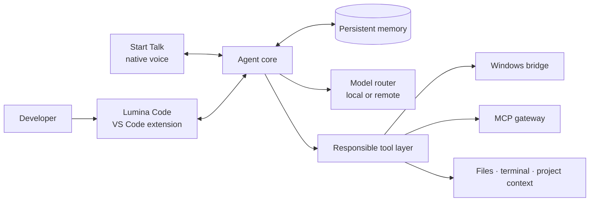

<p align="center">
  
</p>

<h1 align="center">Lumina Code</h1>

<p align="center">
  <strong>IA que trabaja a tu lado.</strong><br>
  <em>A Windows-first, local-first AI coding agent built around voice, memory, and responsible tools.</em>
</p>

<p align="center">
  
  
  
  
</p>

<p align="center">
  <a href="#estado-del-proyecto--project-status">Estado</a> ·
  <a href="#arquitectura-en-evolución--evolving-architecture">Arquitectura</a> ·
  <a href="#instalación-y-requisitos--installation-and-requirements">Instalación</a> ·
  <a href="#configuración-recomendada-de-modelos--recommended-model-setup">Modelos</a> ·
  <a href="CONTRIBUTING.md">Contribuir</a> ·
  <a href="ROADMAP.md">Roadmap</a> ·
  <a href="SECURITY.md">Seguridad</a>
</p>

> [!IMPORTANT]
> **Lumina Code sigue en desarrollo activo.** El código fuente ya está disponible como snapshot comunitario, pero el proceso de instalación y la separación de configuración privada todavía se están estabilizando. No existe una release pública estable ni un instalador recomendado. Los issues, las propuestas, la documentación y los pull requests enfocados son bienvenidos.

## Qué es / What it is

**Lumina Code** es un agente de programación para Windows que busca reunir en una sola experiencia capacidades que normalmente viven separadas: conversación sobre código, ejecución asistida por herramientas, voz nativa, memoria persistente e interoperabilidad mediante MCP.

El objetivo no es crear otro cuadro de chat. Es construir un colaborador técnico que pueda comprender el contexto de un proyecto, explicar sus decisiones, pedir confirmación cuando una acción lo requiere y permanecer útil durante sesiones reales de trabajo.

**English:** Lumina Code is a Windows-first AI coding agent that brings code conversation, tool-assisted work, native voice, persistent memory, and MCP interoperability into one coherent experience. It is being developed as a technical collaborator, not merely another chat panel.

## Principios del proyecto / Project principles

| Principio                    | Qué significa                                                                                                                       |
| ---------------------------- | ----------------------------------------------------------------------------------------------------------------------------------- |
| **Local-first**              | El runtime, los puentes y el control permanecen cerca del usuario. Los modelos pueden ser locales o remotos según la configuración. |
| **Windows-first**            | La experiencia se diseña y prueba primero sobre flujos reales de Windows y VS Code.                                                 |
| **Voz como interfaz real**   | Start Talk busca convertir la conversación por voz en una parte nativa del trabajo, no en un complemento decorativo.                |
| **Herramientas con límites** | Las acciones sensibles deben ser explícitas, verificables, auditables y restringidas por contexto.                                  |
| **Memoria con propósito**    | Recordar debe mejorar la continuidad sin ocultar al usuario qué información se conserva ni por qué.                                 |
| **Interoperabilidad**        | MCP y los puentes modulares permiten conectar Lumina Code con otros clientes y herramientas.                                        |

## Capacidades en desarrollo / Capabilities in development

- Agente de código dentro de VS Code.
- Experiencia de voz nativa **Start Talk** con orbe de escritorio.
- Contexto y memoria entre sesiones.
- Enrutamiento entre proveedores de modelos y opciones locales.
- Herramientas responsables para archivos, terminal y flujos de desarrollo.
- Puente Windows para acciones de escritorio con controles de seguridad.
- Gateway MCP para interoperar con otros clientes compatibles.
- Registro de actividad y superficies de transparencia para acciones del agente.

Estas capacidades reflejan la dirección técnica actual. Su interfaz, alcance y disponibilidad pueden cambiar antes de la primera versión pública estable.

## Estado del proyecto / Project status

| Área                                                       | Estado público                  |
| ---------------------------------------------------------- | ------------------------------- |
| Licencia Apache 2.0                                        | Publicada                       |
| Atribución a Continue                                      | Publicada en [`NOTICE`](NOTICE) |
| Documentación y proceso comunitario                        | Disponibles                     |
| Snapshot público del código fuente                         | Publicado                       |
| Build reproducible desde un equipo limpio                  | **En preparación**              |
| Configuración raíz unificada y `.env.example` del proyecto | **En preparación**              |
| Build público de prueba                                    | Aún no disponible               |
| Release estable                                            | Aún no disponible               |

El desarrollo continúa de forma constante. La prioridad inmediata es convertir el snapshot disponible en una base que pueda configurarse, compilarse y verificarse desde un equipo limpio sin depender del entorno privado del autor.

## Arquitectura en evolución / Evolving architecture



La arquitectura se mantiene modular para separar razonamiento, memoria, voz y acciones del sistema. Los límites entre estos componentes forman parte del trabajo activo de estabilización.

## Instalación y requisitos / Installation and requirements

> [!WARNING]
> **El flujo siguiente es experimental y está dirigido a colaboradores.** Todavía no hay una release, un VSIX firmado ni una publicación en Marketplace. Construye e instala solamente código que hayas revisado.

Los requisitos provisionales del entorno de desarrollo son:

| Requisito                            | Uso previsto                                                              |
| ------------------------------------ | ------------------------------------------------------------------------- |
| Windows 10/11 x64                    | Plataforma de build documentada actualmente                               |
| VS Code 1.70 o superior              | Extension Development Host                                                |
| Git                                  | Clonación y flujo de contribución                                         |
| Node.js 20.20.1                      | Extensión y monorepo base; versión indicada en `continue-upstream/.nvmrc` |
| Rust `stable-msvc`                   | Aplicación nativa Start Talk basada en Tauri                              |
| Microsoft C++ Build Tools y WebView2 | Requisitos de Tauri sobre Windows                                         |
| Node.js 22                           | Bridges TypeScript opcionales; no se usa para empaquetar la extensión     |
| Python                               | Sidecars opcionales para ciertas integraciones Windows                    |

### Preparar el proyecto y abrirlo en modo desarrollador

```powershell
git clone https://github.com/I24D/Lumina_Code.git
cd Lumina_Code\Start-talk
npm install
npm run tauri build -- --no-bundle
cd ..\continue-upstream
powershell -NoProfile -ExecutionPolicy Bypass -File .\scripts\install-dependencies.ps1
cd ..
powershell -NoProfile -ExecutionPolicy Bypass -File .\ABRIR_LUMINA_CODE_DEV.ps1
```

Start Talk debe compilarse primero porque su ejecutable se incluye dentro del VSIX. `install-dependencies.ps1` no es una comprobación pasiva: instala dependencias, compila varios módulos y genera un primer paquete. El proceso necesita red, puede tardar y todavía no ha sido validado desde una máquina Windows limpia.

El launcher abre un **VS Code Extension Development Host aislado** y levanta la interfaz de desarrollo en `127.0.0.1:5174`; no reemplaza tu instalación normal de VS Code.

### Configuración recomendada de modelos / Recommended model setup

Lumina Code permite configurar otros proveedores, pero la configuración de referencia del autor —y la combinación recomendada para reproducir el funcionamiento actual— es la siguiente:

| Función                                    | Proveedor    | Modelo                                 | Credencial necesaria                 |
| ------------------------------------------ | ------------ | -------------------------------------- | ------------------------------------ |
| Chat principal, edición y agente de código | Ollama Cloud | `glm-5.2:cloud`                        | API key de Ollama                    |
| Voz en tiempo real mediante Start Talk     | Gemini Live  | `gemini-2.5-flash-native-audio-latest` | `GEMINI_API_KEY` de Google AI Studio |

#### Chat y agente: Ollama Cloud con GLM 5.2

1. Crea una API key en [Ollama](https://ollama.com/settings/keys).
2. En Lumina Code, abre **Add model**, selecciona **Ollama Cloud** y elige **GLM-5.2 (Ollama Cloud)**.
3. Introduce la API key cuando la interfaz la solicite. La configuración usa internamente:
   - proveedor: `ollama`;
   - modelo: `glm-5.2:cloud`;
   - API base: `https://ollama.com/`.
4. Selecciona el modelo para los roles de chat, edición y aplicación según tu flujo de trabajo.

La ficha oficial del modelo y su disponibilidad se encuentran en [Ollama Library: GLM 5.2](https://ollama.com/library/glm-5.2). Ollama Cloud evita necesitar una GPU local capaz de ejecutar este modelo, pero requiere una cuenta y está sujeto a los límites y precios de Ollama.

#### Start Talk: Gemini Live

Crea una clave para Gemini API en [Google AI Studio](https://aistudio.google.com/api-keys) y guárdala en un archivo `.env` privado. Para el flujo de desarrollo documentado, puede colocarse en la raíz del clon:

```dotenv
# C:\ruta\a\Lumina_Code\.env
GEMINI_API_KEY=<TU_API_KEY_DE_GEMINI>

# Opcional: coincide con el modelo de voz seleccionado actualmente por defecto.
START_TALK_GEMINI_MODEL=gemini-2.5-flash-native-audio-latest
```

Start Talk busca `GEMINI_API_KEY` en el entorno y en archivos `.env` ascendiendo desde el workspace. También puedes indicar otro archivo mediante la opción de VS Code `lumina.startTalk.envFile`; la extensión importa esa configuración a Secret Storage para reutilizarla en distintos proyectos. Reinicia o recarga el Extension Development Host después de cambiar estas variables.

> [!CAUTION]
> Las claves de Ollama y Gemini son credenciales diferentes y no son intercambiables. No pegues valores reales en este README, commits, issues, capturas o archivos versionados. El `.env` raíz está ignorado por Git; verifica siempre `git status` antes de publicar cambios.

**English:** For the known-working reference setup, use Ollama Cloud with `glm-5.2:cloud` for the main coding agent and a separate Gemini API key for Start Talk's real-time voice model. Keep both credentials private and never commit them.

#### Lectura de respuestas de los chats

Mientras Start Talk está activo, también puede leer en voz alta las respuestas finales de Lumina Code, Claude Code y el chat de Codex para VS Code. La integración de Codex sigue únicamente sesiones visibles con origen `codex_vscode`: no reproduce conversaciones antiguas, comentarios de progreso, razonamiento, llamadas de herramientas ni ejecuciones `codex_exec`. Puede desactivarse con `START_TALK_READ_CODEX=false`; la integración de Claude Code puede desactivarse por separado con `START_TALK_READ_CLAUDE_CODE=false`.

Las automatizaciones que interactúan con aplicaciones personales permanecen desactivadas por defecto en el flujo público. Cualquier activación debe ser consciente, explícita y precedida por una revisión de sus permisos.

### Generar o instalar el VSIX

Después de preparar el proyecto, el artefacto se genera desde `continue-upstream/extensions/vscode` con:

```powershell
cd continue-upstream\extensions\vscode
npm run package -- --target win32-x64
Get-ChildItem .\build\*.vsix
```

Consulta la guía completa de [instalación, generación e instalación del VSIX](docs/INSTALLATION_AND_VSIX.md). Incluye verificaciones, ubicación del artefacto, instalación desde la interfaz o la CLI de VS Code, limitaciones y errores frecuentes.

Después de instalar o abrir la extensión, inicia el orbe mediante **Lumina Code: Start Talk (orbe de escritorio)**. Ejecutar `start-talk.exe` directamente omite el puente de comunicación con Lumina Code.

Los componentes avanzados tienen documentación propia:

- [Lumina Windows Bridge](Lumina_PC/apps/lumina-windows-bridge/README.md)
- [Lumina MCP Gateway](Lumina_PC/apps/lumina-mcp-gateway/README.md)

Todavía se está preparando un `.env.example` raíz y un diagnóstico único para validar todos los servicios. Algunos módulos ya incluyen ejemplos locales, pero varias integraciones no funcionarán hasta completar la configuración unificada. Sigue este repositorio con **Watch** para recibir los anuncios de builds verificadas.

## Contribuir / Contributing

Este proyecto quiere crecer con una comunidad cuidadosa, crítica y creativa. No necesitas esperar a la primera release para participar.

Puedes contribuir ahora mediante:

- [reportes claros de errores o inconsistencias](https://github.com/I24D/Lumina_Code/issues/new?template=bug_report.yml);
- [propuestas de funciones](https://github.com/I24D/Lumina_Code/issues/new?template=feature_request.yml);
- mejoras de documentación y traducción;
- revisión de experiencia de usuario, accesibilidad y seguridad;
- casos de uso reales para desarrollo, educación y automatización responsable;
- participación en [Discussions](https://github.com/I24D/Lumina_Code/discussions).

Lee [`CONTRIBUTING.md`](CONTRIBUTING.md) antes de abrir un pull request. Toda contribución debe respetar el [`CODE_OF_CONDUCT.md`](CODE_OF_CONDUCT.md) y se recibirá bajo la licencia Apache 2.0 del proyecto.

## Roadmap

El plan público se mantiene en [`ROADMAP.md`](ROADMAP.md). Las prioridades actuales son:

1. sanear y separar la configuración privada;
2. publicar un árbol de código reproducible;
3. documentar un flujo de desarrollo verificable;
4. preparar una build comunitaria de prueba;
5. abrir módulos concretos a contribuciones de código.

No se anuncian fechas artificiales. Cada fase se considerará lista cuando otra persona pueda reproducirla y verificarla.

## Seguridad / Security

Lumina Code interactúa con código, terminales y herramientas del sistema, por lo que la seguridad no es una característica secundaria. No publiques vulnerabilidades, credenciales ni registros sensibles en un issue público. Consulta [`SECURITY.md`](SECURITY.md) para reportar un problema de forma responsable.

## Atribución a Continue / Continue attribution

Lumina Code está basado en parte en el proyecto open source [Continue](https://github.com/continuedev/continue), desarrollado por Continue Dev, Inc. y distribuido bajo Apache License 2.0. Lumina Code contiene modificaciones propias y no está respaldado ni afiliado oficialmente con Continue Dev, Inc.

La atribución completa se encuentra en [`NOTICE`](NOTICE).

## Ecosistema Lumina / Lumina ecosystem

- [**Public-Lumina**](https://github.com/I24D/Public-Lumina): arquitectura, decisiones de diseño y roadmap general de la plataforma.
- [**Lumina: La promesa de un sueño**](https://github.com/I24D/Lumina-Novela): la historia detrás de la visión, disponible en español e inglés.

## Licencia / License

Copyright © 2026 I24D and Lumina Code contributors.

Licensed under the [Apache License 2.0](LICENSE). Third-party components remain subject to their respective licenses and notices.

<p align="center">
  <strong>Construido en público, mejorado con paciencia y abierto a quienes quieran ayudar.</strong>
</p>
