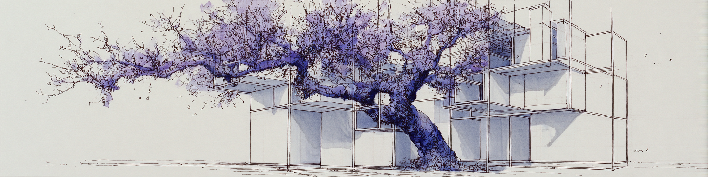

<h1 align="center">Lumina Code — agent source</h1>

VS Code agent, core runtime and webview used by Lumina Code

> This directory is the forked agent source used by the public
> [Lumina Code repository](../README.md). Build and installation instructions,
> the supported Windows workflow, model setup and current feature status live
> in the root README. The upstream Continue history and Apache 2.0 attribution
> are preserved below and in [`../NOTICE`](../NOTICE).

Lumina-specific workflows currently include Session Goals, GitHub issue/PR
session preparation, guided changes, a work dashboard and persistent scheduled
agent work. The single React webview also provides the responsive Lumina
workspace, recent sessions, prompt queue, Connections, Knowledge, runtime
diagnostics and secure Start Talk configuration. Open the chat and type `/` to
discover agent actions. Their behavior and safety boundaries are documented in
[`../docs/AGENT_WORKFLOWS.md`](../docs/AGENT_WORKFLOWS.md), while the unified UI
architecture is described in
[`../docs/UNIFIED_WORKSPACE.md`](../docs/UNIFIED_WORKSPACE.md).

  

## Upstream foundation: Continue

> _Note: The `continuedev/continue` repository is no longer actively maintained and is read-only for all users._

Continue is a coding agent available as a [CLI](#cli), [VS Code extension](#vs-code), and [JetBrains plugin](#jetbrains).

## Documentation

To learn how to configure Continue, how it works, and how to customize it, check out the [Continue Docs](https://docs.continue.dev).

## Final 2.0.0 Release

We polished Continue and did a final 2.0.0 release of the VS Code extension, CLI, and JetBrains plugin.

This included removing anonymous telemetry, pulling out authentication, squashing bugs, and more.

### VS Code

  

### CLI

 

### JetBrains

> _Note: We recommend using the Continue CLI instead of the JetBrains plugin._

 

## Contributors

Thank you to the entire Continue community for helping us create a pioneering coding agent.

What we built together pushed the boundaries of what AI developer tooling could be.

We hope this codebase continues to serve as a foundation for others.

## Code friends

## License

Apache 2.0 © 2023-2026 Continue Dev, Inc.
